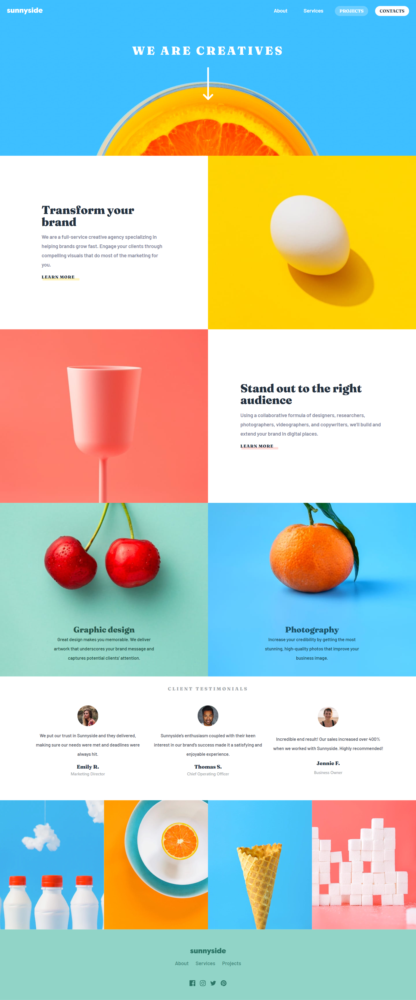
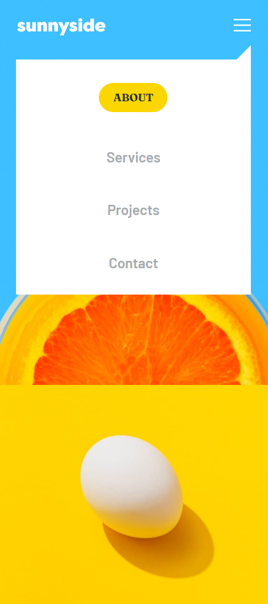

# Frontend Mentor - Sunnyside agency landing page solution

This is a solution to the [Sunnyside agency landing page challenge on Frontend Mentor](https://www.frontendmentor.io/challenges/sunnyside-agency-landing-page-7yVs3B6ef). Frontend Mentor challenges help you improve your coding skills by building realistic projects.

## Table of contents

- [Overview](#overview)
  - [The challenge](#the-challenge)
  - [Screenshot](#screenshot)
  - [Links](#links)
- [My process](#my-process)
  - [Built with](#built-with)
  - [What I learned](#what-i-learned)
  - [Continued development](#continued-development)
  - [Useful resources](#useful-resources)
- [Author](#author)
- [Acknowledgments](#acknowledgments)

## Overview

### The challenge

The challenge is to build out a landing page and get it looking as close to the provided design as possible.

This challenge focuses mostly on HTML & CSS. There's a tiny bit of JS included for the mobile navigation toggle.

Users should be able to:

- View the optimal layout for the site depending on their device's screen size
- See hover states for all interactive elements on the page

### Screenshot

### Links

- Solution URL: [Github Repo](https://github.com/Rgit915/sunnyside-agency-landing-page)
- Live Site URL: [Live Demo](https://sunnyside-agency-landing-page-rora.netlify.app/)

## My process

### Built with

- Semantic HTML5 markup
- CSS custom properties
- Flexbox
- Mobile-first workflow
- [React](https://reactjs.org/) - JS library
- [Tailwind CSS](https://tailwindcss.com/) - For styles

# What I learned

- **Structured Data with JSON**: Utilized JSON data structuring to avoid code repetition and efficiently manage content for the website.

- **Dynamic Data Rendering**: Leveraged JSON data in React components for dynamic content rendering, enhancing flexibility and maintainability.

- **State Management**: Implemented state management in React to handle link clicks and manage menu navigation, especially on smaller screens.

- **Responsive Design**: Ensured optimal layout and responsiveness across various screen sizes, improving the overall user experience.

- **Mobile Navigation**: Positioned and styled the navigation menu for smaller screens, enhancing accessibility and usability on mobile devices.

- **Design Consistency**: Strived to match the provided design as closely as possible, paying attention to details and maintaining design consistency throughout the project.

### Continued Development

In future projects, I plan to further explore:

- Incorporating animations and transitions for a more interactive user experience.

### Useful Resources

- [React Documentation](https://reactjs.org/docs/getting-started.html) - The official React documentation is always my go-to resource for understanding React concepts and best practices.
- [Tailwind CSS Documentation](https://tailwindcss.com/docs) - The Tailwind CSS documentation provides comprehensive guidance on using Tailwind's utility classes effectively.

## Author

- Frontend Mentor - [@Rgit915](https://www.frontendmentor.io/profile/Rgit915)
- Github - [@Rgit915](https://github.com/Rgit915)

## Acknowledgments
I would like to thank [Frontend Queens](https://beacons.ai/frontendqueens) for providing this challenge and motivating us to work on various aspects of challenges, as well as [Frontend Mentor](https://www.frontendmentor.io/) for their platform that enable developers to practice and enhance their skills through real-world projects.